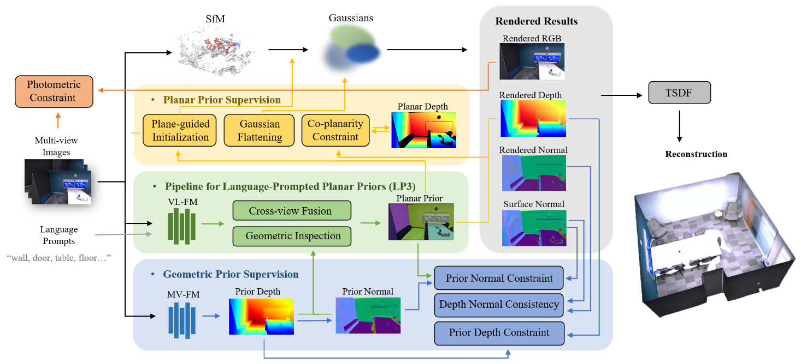

# PlanarGS: High-Fidelity Indoor 3D Gaussian Splatting Guided by Vision-Language Planar Priors
Xirui Jin, Renbiao Jin, [Boying Li](https://leeby68.github.io), [Danping Zou](https://drone.sjtu.edu.cn/dpzou), Wenxian Yu

### **NeurIPS 2025**
### [Project Page](https://planargs.github.io/) | [arXiv](https://arxiv.org/abs/2510.23930)


PlanarGS combines planar priors from the LP3 pipeline and geometric priors from the pretrained multi-view foundation model with 3D Gaussian Splatting to achieve high-fidelity indoor surface reconstruction from multi-view images. We acheive up to **36.8%** and **43.4%** relative improvements in accuracy on the MuSHRoom and Replica datasets, respectively, with Chamfer distance below **5 cm**. The experiments require one RTX 3090 GPU and take approximately 1 hour to reconstruct a scene.
## Todo List
- [x] ~~Push main code and provide COLMAP-processed datasets.~~
- [ ] Offer code for alignment and evaluation of reconstructed mesh.
## Installation

```shell
git clone https://github.com/SJTU-ViSYS-team/PlanarGS.git --recursive  
cd PlanarGS

conda create -n planargs python=3.10
conda activate planargs
pip install cmake==3.20.*

pip install torch==2.4.1 torchvision==0.19.1 torchaudio==2.4.1 --index-url https://download.pytorch.org/whl/cu118  #replace your cuda version

pip install -r requirements.txt 
```
Install submodules:
``` shell
pip install -e submodules/simple-knn --no-build-isolation 
pip install -e submodules/pytorch3d --no-build-isolation   
pip install submodules/diff-plane-rasterization --no-build-isolation   
```
### Installation of GroundedSAM
We use the pre-trained vision-language foundational model [GroundedSAM](https://github.com/IDEA-Research/Grounded-Segment-Anything) in the Pipeline for Language-prompted planar priors (LP3). You can download and install it following:
```shell
cd submodules 
git clone https://github.com/IDEA-Research/Grounded-Segment-Anything.git 
mv Grounded-Segment-Anything groundedsam

cd groundedsam && pip install -e segment_anything
pip install --no-build-isolation -e GroundingDINO 
&& cd ../..
```
- Please download checkpoints of GroundedSAM from [link1](https://github.com/IDEA-Research/GroundingDINO/releases/download/v0.1.0-alpha/groundingdino_swint_ogc.pth
) and [link2](https://dl.fbaipublicfiles.com/segment_anything/sam_vit_h_4b8939.pth), and put them into the `ckpt` folder.
## Dataset Preprocess
We evaluate our method on multi-view images from three indoor datasets:

- [Replica](https://github.com/facebookresearch/Replica-Dataset/): We use eight scenes (office0–office4 and room0–room2), sampling 100 views from each scene.

- [ScanNet++](https://scannetpp.mlsg.cit.tum.de/scannetpp/): We select four DSLR-captured sequences: 8b5caf3398, b20a261fdf, 66c98f4a9b, and 88cf747085.

- [MuSHRoom](https://xuqianren.github.io/publications/MuSHRoom/): Our experiments include five iPhone-captured short sequences: coffee_room, classroom, honka, kokko, and vr_room.

We provide all the above above data preprocessed by COLMAP, which can be downloaded from [Hugging Face Datasets](https://huggingface.co/datasets/Isabellaxr/PlanarGS_dataset/tree/main) and [Google Drive](https://drive.google.com/file/d/1HsgHZt23ECoug8WTRQVHviGu9h5HgSA9/view?usp=sharing). Starting from these data, you can conveniently evaluate the reconstructed meshes from PlanarGS **(evaluation code to be open-sourced in a few days)**.

**❗Custom Data :** \
If you want to try PlanarGS on other scenes, please use [COLMAP](https://colmap.github.io/) to obtain camera poses and sparse point cloud from multi-view images, and organize the COLMAP results into the **images** and **sparse** directories as shown in our overview of data directory below.
### Generation of Geometric Priors
We use the pre-trained multi-view foundational model [DUSt3R](https://github.com/naver/dust3r) (code is in the `submodule` folder) to generate geometric priors. Please download the checkpoints of DUSt3R from [link3](https://download.europe.naverlabs.com/ComputerVision/DUSt3R/DUSt3R_ViTLarge_BaseDecoder_512_dpt.pth) and put it into the `ckpt` folder.
```shell
# data_path represents the path to a scene folder of a dataset.
python run_geomprior.py -s data_path --group_size 40 #--vis
```
- By default, we sample and extract **40** images per group to run DUSt3R. If your GPU has limited memory (e.g., RTX 3090 with 24GB VRAM), setting `--group_size 25` can help reduce memory usage. However, this may slightly reduce the accuracy of DUSt3R and consequently impact the quality of PlanarGS reconstruction.
- DUSt3R can be swapped out for another multi-view foundation model by adding the model to the `submodules` directory and writing the corresponding `./geomprior/run_dust3r.py` code.
### Pipeline for Language-prompted planar priors (LP3)
One of the advantages of using the open-vocabulary foundation model is that, for the scene-specific training of PlanarGS, you can freely design **prompts** tailored to the characteristics of each scene, which may further improve the LP3 pipeline and enhance the reconstruction performance of PlanarGS. 
- The prompts provided with the `-t` option below are suitable for most indoor scenes. 
- You may also add or remove prompts according to **the planar objects** present in the scene, especially for planes that appear curved in the reconstructed meshes.
```shell
python run_lp3.py -s data_path -t "wall. floor. door. screen. window. ceiling. table" #--vis
```
- GroundedSAM can be swapped out for another vision-language foundation model by adding the model to the `submodules` directory and writing the corresponding `./lp3/run_groundedsam.py` code.
### Overview of Data Directory
The data directory after preprocession should contain the following components to be complete for training.
```shell
└── <data_path>
    ├── images
    ├── sparse
    │   ├── cameras.bin
    │   ├── images.bin
    │   └── points3D.bin
    ├── geomprior
    │   ├── aligned_depth
    │   ├── resized_confs
    │   ├── prior_normal
    │   └── depth_weights.json
    └── planarprior
        └── mask
```

## Training and Evaluation
Run `train.py` for 30,000 iterations to obtain the Gaussian reconstruction result `point_cloud.ply`. Then run `render.py` to render color images, depth maps, and normal maps from the reconstructed Gaussians, and generate a mesh `tsdf_fusion_post.ply` using the TSDF method. (The meshes can be viewed with [MeshLab](https://www.meshlab.net/)).

- For mesh generation, you can adjust the parameters `--voxel_size` and `--max_depth` according to the scene.
- The `--eval` option splits the scene into training and test sets for novel view synthesis evaluation.

```shell
python train.py -s data_path -m output_path  #--eval
python render.py -m output_path --voxel_size 0.02 --max_depth 100.0  #--eval
```
If you enable `--eval` during training and rendering, you can run `metrics.py` to evaluate the quality of novel view synthesis.
```shell
python metrics.py -m output_path
```

## Acknowledgements
This project is built upon [3DGS](https://github.com/graphdeco-inria/gaussian-splatting) and [PGSR](https://github.com/zju3dv/PGSR), and evaluation scripts are based on [NICE-SLAM](https://github.com/cvg/nice-slam). For the usage of the foundation models, we make modifications on the demo code of [DUSt3R](https://github.com/naver/dust3r) and [GroundedSAM](https://github.com/IDEA-Research/Grounded-Segment-Anything). We thank the authors for their great work and repos. 


## Citation

If you find this code useful for your research, please use the following BibTeX entry.

```bibtex
@inproceedings{jin2025planargs,
  title     = {PlanarGS: High-Fidelity Indoor 3D Gaussian Splatting Guided by Vision-Language Planar Priors},
  author    = {Xirui Jin and Renbiao Jin and Boying Li and Danping Zou and Wenxian Yu},
  year      = {2025},
  booktitle = {Proceedings of the 39th International Conference on Neural Information Processing Systems}
}
```